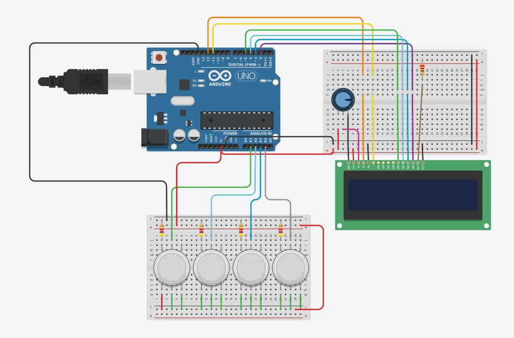
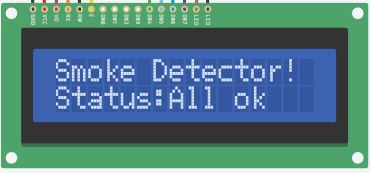

# Optical Smoke Alarm Using Arduino
**An Optical Smoke Detector is a device that senses smoke, typically as an indicator of fire.**

## Components Used

* IC MOC7811
* Arduino Uno
* 16x2 LCD screen

## Description
Optical smoke alarm uses MOC 7811 which is an *optocoupler*.The sensor designed for this device is based on the principle of scattering of *infrared rays*.The light coming from the light source passes through the air being tested and reaches the photosensor. In case of smoke, the received light intensity will be reduced by absorption due to smoke. It can be easily observed while simulating the circuit. This change in light intensity again causes change in the resistance and hence results in the voltage drop. As this happens, the transistor T1 (as shown in the schematic) stops working and transistor T2 starts working and starts off the buzzer. Sensitivity of the sensor can be set by changing the variable resistence of 4.7kΩ. Capacitor C1 is used in case the power cuts off the circuit will still work.

## Schematic of the whole circuit

## Implementation Of The Circuit

### When there is no gas and perfectly normal situation then:

### When gas in zone 1:

### 
